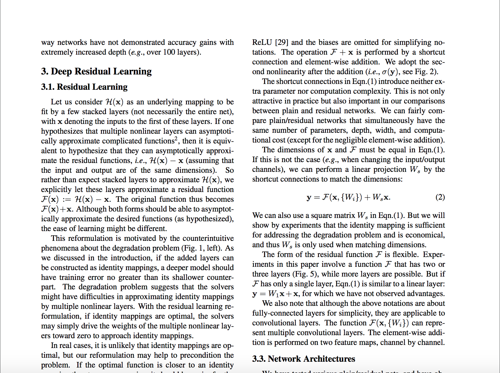
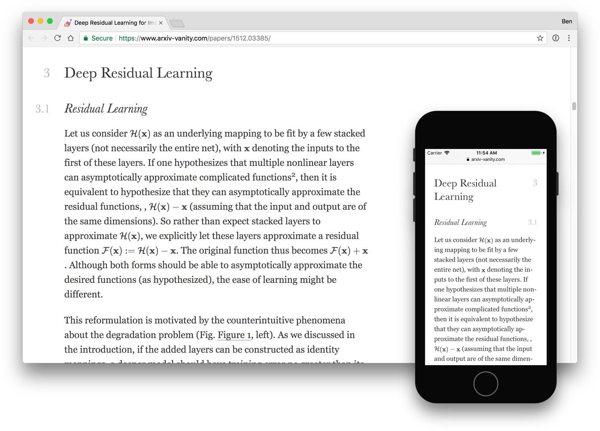

# Engrafo

Engrafo converts LaTeX documents into beautiful responsive web pages using [LaTeXML](https://dlmf.nist.gov/LaTeXML/).

It is a set of stylesheets and scripts for LaTeXML output. It makes the design responsive so you can read it on phones, and adds various interactive bits like footnote tooltips.

It turns this sort of thing:



Into this:



## Usage

The easiest way to run Engrafo is by using the Docker image. To convert `input/main.tex` into `output/index.html`, run:

    $ docker run \
      -v "$(pwd)":/workdir -w /workdir \
      arxivvanity/engrafo engrafo input/main.tex output/

Input can be a TeX file, a directory containing a TeX file and supporting files, or a tarball containing a TeX file and supporting files.

Either input or output can be on S3 by using the form `s3://bucket/path` and setting the `AWS_ACCESS_KEY_ID` and `AWS_SECRET_ACCESS_KEY` environment variables.

For full usage, run `docker run arxivvanity/engrafo engrafo --help`.

## Server

Engrafo can also be run as an HTTP server, which is useful if you need to run it over a network.

    $ docker run -e PORT=8000 -e AWS_ACCESS_KEY_ID -e AWS_SECRET_ACCESS_KEY -p 8000:8000 arxivvanity/engrafo engrafo-server
    💃  Listening on http://0.0.0.0:8000

    $ curl -X POST \
        -H 'Content-Type: application/json' \
        -d '{"input": "s3://some-bucket/source.tar.gz", "output": "s3://some-bucket/output/"}' \
        http://localhost:8000/convert
    {
        "success": true,
        "logs": "..."
    }

## Development environment

First, install [Node](https://nodejs.org/en/) and [Yarn](https://yarnpkg.com/en/docs/install#mac-stable). Then, install the Node dependencies:

    $ yarn

### Frontend development

For developing the CSS and frontend JavaScript, there are a bunch of pre-rendered documents you can use to work with. This means you don't need to install LaTeX or Docker.

Run this command:

    $ yarn run storybook

Then, all the documents will be available as a Storybook at [http://localhost:6006](http://localhost:6006). Any changes you make to the CSS and JS in `src/assets/` will automatically be updated in the Storybook.

### Converting documents

The LaTeXML and LaTeX toolchain runs inside Docker. If you want to work on the code that actually converts documents, you will need to install Docker.

[Install Docker](https://docs.docker.com/install/) and build the Docker image:

    $ script/docker-build

You can convert documents with `yarn run convert`:

    $ yarn run convert tests/documents/sample2e.tex output/

There is also a development server, which is useful for developing CSS and JavaScript. When you make changes to the JavaScript or CSS, it will automatically update in the browser:

    $ yarn run dev-server tests/documents/sample2e.tex

There is a script to download a paper from arXiv and start a development server:

    $ script/arxiv-dev-server 1707.08901

## Tests

As a one-off, you will need to build the Docker image:

    $ script/docker-build

This only needs running once, unless you change something in the build process (e.g. LaTeXML version). The code is mounted at run-time.

Run the main test suite:

    $ yarn test

You can run particular suites:

    $ yarn test tests/integration.test.js

Or particular tests by matching a string:

    $ yarn test -t "titles and headings"

### Writing integration tests

The integration tests are LaTeX documents in `tests/integration` that are rendered to ensure they produce a particular output. The HTML output from LaTeXML is checked using [Jest snapshots](https://jestjs.io/docs/en/snapshot-testing), and the visual output is checked using [Percy](https://percy.io/).

First, write a LaTeX document in `tests/integration`. If it is a test for a package, it normally has the same name as the package, as you can see from other documents in that directory.

For example, this could be a test in `tests/integration/textbf.tex`:

```latex
\begin{document}
  I am \textbf{bold}!
\end{document}
```

Now, run the test passing the `-u` option to write out a snapshot of what is rendered:

    $ yarn test -t "textbf.tex" -u

Check the output looks correct in `tests/__snapshots__/integration.test.js.snap`. You can re-run that command without the `-u` option to ensure the test passes.

The test will fail if the output changes in the future. If the change is expected, then you can simply re-run the test with `-u` to overwrite the snapshot and fix the test.

The visual changes are harder to test locally. The easiest way is to open a pull request, then Percy will check for any changes against master.

## Code style

All code must be formatted with [Prettier](https://prettier.io/). To automatically format the code, run:

    $ yarn run prettier

## Sponsors

Thanks to our generous sponsors for supporting the development of arXiv Vanity!

[](https://www.yld.io/)

Tested by:

[](https://percy.io/)
